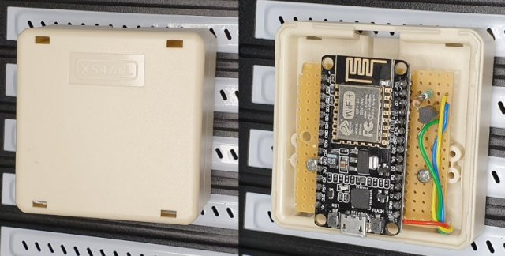

# ESPHome PC Power Control via Home Assistant

This project contains remote PC power control via HomeAssistant and ESPHome ESP8266/ESP32 boards.

I use this project to power my PC based NAS remotely on and off via Home Assistant as alternative to Wake-On-Lan (WOL) which has known limitations.

## Features

* Control physical PC power button (front panel) connected to the motherboard:
  * Turn PC power on from any power state such as `power-off/suspended/hybernate` (Behavior short press power button).
  * Graceful `shutdown/suspend/hybernate` of the operating system (Behavior short press power button).
  * Force power-off (Behavior long press power-button).
* Read PC power on/off status from motherboard.
* No operating system dependency.
* Power/reset buttons front panel remains full functional.
* User authorization via Homeassistant.
* Use with any (micro/mini)-ATX computer motherboard.

Youtube video:

[](https://www.youtube.com/watch?v=rAcvqaPf830)

Homeassistant screenshot:


## Differences Wake-On-Lan (WOL) magic packet

[Wake-On-Lan (WOL)](https://en.wikipedia.org/wiki/Wake-on-LAN) is intended to turn computer power on remotely via Ethernet by sending a so called `magic packet`. This has several known limitations which are not applicable with this ESP project:

* Wake-On-Lan (WOL) has **no authorization**! The WOL protocol has no functionality to provide a password or allow a specific computer to wake from. Any device on the same LAN can wake a PC by sending a magic packet. The ESP is password protected via Homeassistant.
* Wake-On-Lan (WOL) can only `wake` a PC from suspend or power-off state. There is no shutdown/suspend functionality. 
* To put a Linux machine in `sleep` state, a SSH connection to the remote PC can be made for example by executing `pm-suspend` command (Install via `sudo apt install pm-utils`), reference [Ubuntu pm-action documentation](https://manpages.ubuntu.com/manpages/jammy/man8/pm-action.8.html). Disadvantages:
  * Requires SSH login.
  * Requires sudo rights.
* Wake-On-Lan magic packets are ignored when connecting main power the first time to the power supply, even when WOL is activated in the BIOS. The reason is that WOL is disabled on most computers at first power on and requires activation by a running operating system before the PC responds on a magic packet to wake the computer. Reference: [Ubuntu Wake-On-Lan](https://help.ubuntu.com/community/WakeOnLan).
* Running Homeassistant [Wake-On-Lan](https://www.home-assistant.io/integrations/wake_on_lan) in a Docker container cannot forward broadcast magic packets with a bridged network configuration. It requires an external Docker container as bridge to forward magic packages and is beyond the scope of Homeassistant. This is currently not included in Homeassistant documentation.

## Hardware

The hardware consists of an ESP8266 or ESP32 and two IO pins, mounted on a PCI metal plate (see picture below). In my case I used an ESP8266 NodeMCU board. Theoretically any ESP8266 or ESP32 board can be used for this project.

* One pin controls the power button by generating a long or short press
* A second pin reads the motherboard power status.


## Schematic

My NAS is based on an Intel Core I7 ASRock Z97 ATX motherboard and contains standard 2.5mm 2x5 male headers:


**ATX header USB 2.0:**

Header `J1` pin 1 constant +5V power on pin 1, even when the PC is power-off and is used to power the NodeMCU. The ESP8266 or ESP32 is powered via an on-board 3V3 regulator.

**ATX header System panel:**

Header `J2` contains the power, reset and GND pins:

* Power button pin 6.
  * Short press: Turn PC on or generate graceful shutdown.
  * Long press: Generate hard power off.
* Reset button pin 7.
  * Used to read power status via the reset button pin:
    * High: power-on
    * Low: power-off
* GND pin 5.

* Pin `D1` is used to read the power status from the reset pin: High is on, Low is off. Transistor `Q1` is used for secure isolation between ESP8266 and motherboard.
* Pin `D2` is used to pull the power button low to generate a short or long press. Resistor `R1` is used to minimize current when the IO pin is accidentally set to output.

Warning: All ATX and ESP pins must be operating at 3V3.

## Downloads

* [KiCad schematic .SCH](kicad/ESP8266-ESPHome-PC-Power-HomeAssistant.pro)

## Wiring


A DIY breakout PCB can be mounted at the system panel header to connect power button `SW1` and reset button `SW2`.

## WiFi stability

There is sufficient space in an ATX computer case to mount the ESP board. However, the computer case is metal shielded, so the WiFi distance to the base station reduces. It is recommended to place the ESP outside the computer case when the WiFi connection is unstable or distance too low. An ESP32 may result in different WiFi connection stability, but overall it depends on the environment.

ESP8266 PCB mounted at the back of the PC case:



## Software updates

The ESPHome application firmware can be updated via USB connection (virtual serial port) or WiFi OTA (Over The Air update).

Updating the firmware via WiFi is enabled when configuring `ota` in the .yaml file. This requires a WiFi connection between host computer and ESP. OTA update does not work when the login from ESP to WiFi base station fails due to incorrect WiFi credentials. In this case an update via serial is required or via `ap` fallback as configured in the .yaml file.

## ESPHome

The ESPHome application consists of the two Yaml files. One configuration file and a second `secrets.yaml` to store passwords.

Documentation:

* [ESPHome GPIO Switch](https://esphome.io/components/switch/gpio.html)
* [ESPHome Binary Sensor](https://esphome.io/components/binary_sensor/gpio.html)

### Project configuration

Configure the `platform` and `board` as described in [ESPHome documentation](https://esphome.io/components/esphome.html) in `pc-power.yaml`:

```yaml
esphome:
  name: pc-power
  platform: ESP8266 # ESP8266 or ESP32
  board: nodemcuv2  # Any ESP8266 or ESP32 board

wifi:
  ssid: !secret esphome_wifi_ssid
  password: !secret esphome_wifi_password

  # Enable fallback hotspot (captive portal) in case wifi connection fails
  ap:
    ssid: "PC Power Fallback Hotspot"
    password: !secret esphome_ap_password

# Enable logging
logger:

# Enable Home Assistant API
api:
  password: !secret esphome_api_password

# Enable OTA update via WiFi
ota:
  password: !secret esphome_ota_password

switch:
  - platform: gpio
    name: "NAS Power Toggle"
    icon: "mdi:electric-switch"
    pin: D2   # Power button output pin
    id: power_short_press
    inverted: no
    on_turn_on:
    - delay: 150ms
    - switch.turn_off: power_short_press
  - platform: gpio
    name: "NAS HARD POWER OFF"
    icon: "mdi:electric-switch"
    pin: D2   # Power button output pin
    id: power_long_press
    inverted: no
    on_turn_on:
    - delay: 3500ms
    - switch.turn_off: power_long_press

binary_sensor:
  - platform: gpio
    pin: D1   # Power detect input pin (readback from Reset button)
    name: "NAS Power State"
    device_class: power
```

Configure WiFi SSID and passwords in `secrets.yaml`:

```yaml
esphome_api_password: "changeme"
esphome_ota_password: "changeme"
esphome_ap_password: "changeme"
esphome_wifi_ssid: "ssid"
esphome_wifi_password: "password"
```

### Program ESP8266 or ESP32

Connect USB cable to ESP8266 or ESP32 board and enter the following commands. (Examples are tested on Ubuntu). For more information, refer to [ESPHome.io](https://esphome.io/guides/getting_started_command_line.html).

```bash
# Clone this repository
$ git clone git@github.com:Erriez/ESPHomePCPowerControlHomeAssistant.git

# Install Python3 virtualenv
$ sudo apt install python3-virtualenv

# Create virtualenv
$ virtualenv venv

# Activate virtualenv
$ source venv/bin/activate

# Install ESPHome
$ pip install esphome

# Optional: Install platformio updates
$ platformio platform update
$ platformio upgrade

# Optional: Add user permission serial port
$ sudo usermod -a -G dialout <USERNAME>
$ sudo reboot now

# Check ESPHome installation
$ esphome --help

# Optional: Compile program without upload
$ esphome compile pc-power.yaml

# Upload program to ESP8266 or ESP32
$ esphome run pc-power.yaml

# Select serial port or WiFi to upload application

# Check logs
$ esphome logs pc-power.yaml
```

## Home Assistant configuration

This section describes Home Assistant configuration.

### Register ESP device

* `Configuration | Integrations: Add Integration: ESPHome`
* Select hostname or IP address of the ESP device.
* Enter password as configured in `secrets.yml` | `esphome_api_password`.

### Homeassistant | Edit Dashboard | RAW Configuration Editor

Add PC power integration to a dashboard via raw edit:

```yaml
title: Home
views:
  - title: PC
    path: pc
    badges: []
    cards:
      - type: button
        entity: switch.pc_power_toggle
        show_name: true
      - type: button
        tap_action:
          action: none
        entity: binary_sensor.pc_power_state
        hold_action:
          action: none
      - type: button
        tap_action:
          action: toggle
        entity: switch.pc_hard_power_off
        icon_height: 40px
        show_state: false
        show_name: true
        show_icon: true
```

## Version history

Restart Home Assistant and ready to go!

### Update 13 February 2022

* The button pin timing controlled via Homeassistant scripts was not stable. The power pin control has been moved to the ESP firmware which generates a much more accurate timing.
* Renamed the following names:
  * Rename `switch.pc_power_button` to `switch.pc_power_toggle`.
  * Rename `switch.pc_power_button_long_press` to `switch.pc_hard_power_off`.
  * Rename `switch.pc_power_sense` to `switch.pc_power_state`.
